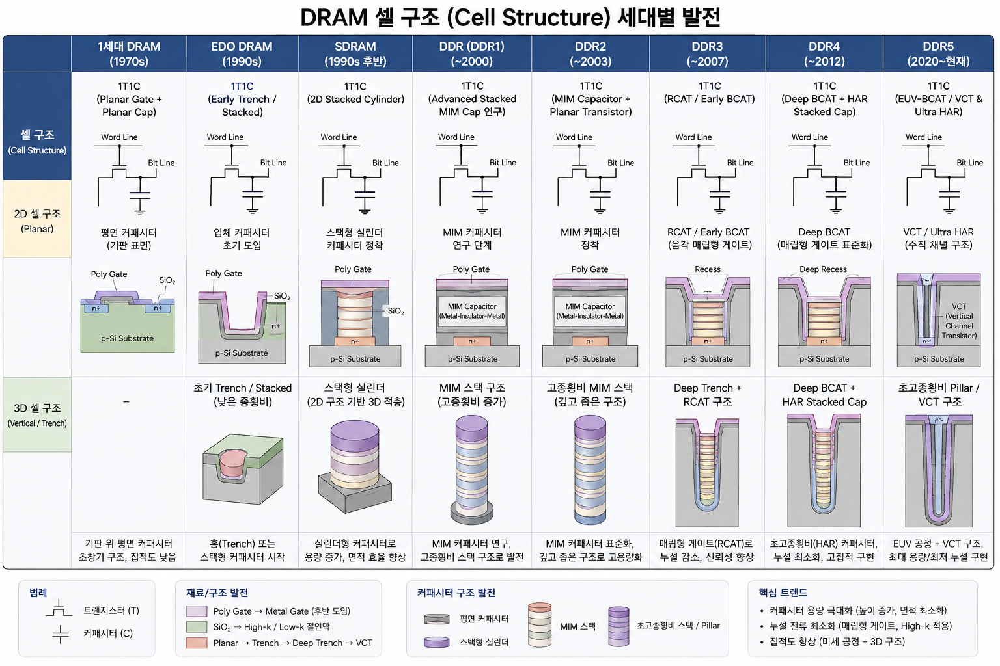
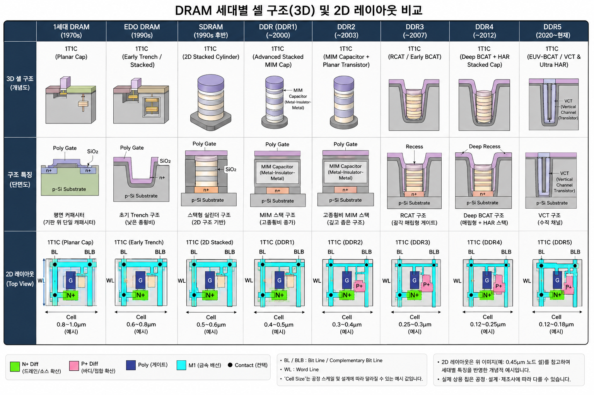

# DRAM / SDRAM 세대별 발전 및 셀 구조 비교 정리

## 1. 개요
DRAM(Dynamic Random Access Memory) 및 SDRAM/DDR 세대별 발전 과정과 셀 구조(Cell Structure)의 변화를 정리한 문서입니다.   
DRAM 셀은 **1개 트랜지스터 + 1개 커패시터(1T1C)** 기본 구조를 유지하며,  
미세화에 따른 **커패시터 전하량($C$) 확보, 누설 전류(Leakage) 감소, 단채널 효과(Short Channel Effect) 극복**을 목표로 발전해 왔습니다.

---

## 2. 세대별 DRAM / SDRAM / DDR 비교 종합표

| 세대 | 공정 / 시기 | 소자 재료 및 구조 | 셀 구조 (Cell Structure) 및 기술 | 속도 | 동작 전압 | 인터페이스 / 대역폭 | 대표 칩 / 패키징 | 주요 특징 |
| :--- | :--- | :--- | :--- | :--- | :--- | :--- | :--- | :--- |
| **1세대 DRAM** | 8μm ~ 12μm (1970s) | Al 게이트, SiO₂ 산화막 | **1T1C (Planar Gate + Planar Cap)** - 기판 표면 평면 커패시터 | ~350ns (Random) | 5V | 비동기식 낮은 대역폭 | Intel 1103 (1Kbit) DIP | 초창기 DRAM, 스케일링 한계 명확 |
| **EDO DRAM** | 600nm ~ 1μm (1990s) | 폴리게이트, SiO₂ | **1T1C (Early Trench / Stacked)** - 입체 커패시터 초창기 도입 | ~40ns (Column) | 3.3V ~ 5V | EDO (출력 유지) FPM 대비 10~15%↑ | SIMM, DIP | 데이터 출력 상태 유지 기술로 속도 향상 |
| **SDRAM** | 250nm ~ 350nm (1990s 후반) | 폴리게이트, SiO₂ | **1T1C (2D Stacked Cylinder)** - 스택형 실린더 커패시터 정착 | 100 ~ 166MHz | 3.3V | 동기식 (클럭 동기화) 최대 1.06 GB/s | PC100/PC133 DIMM, SIMM | 시스템 클럭 동기화, 파이프라인 동작 도입 |
| **DDR (DDR1)** | 180nm ~ 250nm (2000) | 폴리게이트, SiO₂ | **1T1C (Advanced Stacked MIM Cap)** - MIM(Metal-Insulator-Metal) 연구 | 200 ~ 266MHz | 2.5V | DDR (클럭 양 에지 전송) 1.6 ~ 2.1 GB/s | DIMM (184핀) JEDEC 표준 | 2n-prefetch, 클럭의 상승/하강 에지 모두 활용 |
| **DDR2** | 90nm ~ 130nm (2003) | Low-k 다이얼렉트릭 도입 | **1T1C (MIM Capacitor + Planar Transistor)** - MIM 커패시터 정착 | 400 ~ 667MHz | 1.8V | DDR + 4n-prefetch 3.2 ~ 5.3 GB/s | DIMM (240핀) | On-die Termination (ODT), Fly-by 구조 도입 |
| **DDR3** | 65nm ~ 90nm (2007) | High-k 메탈 게이트 도입 (후반) | **1T1C (RCAT / Early BCAT)** - 음각 매립형 게이트 트랜지스터 | 800 ~ 1600MHz | 1.5V (1.35V L) | DDR + 8n-prefetch 6.4 ~ 12.8 GB/s | DIMM (240핀) | ZQ Calibration, Reset 초기화 pin 도입 |
| **DDR4** | 20nm ~ 30nm (2012) | High-k 메탈 게이트, FinFET 점진 적용 | **1T1C (Deep BCAT + HAR Stacked Cap)** - 매립형 BCAT 게이트 표준화 | 1600 ~ 3200MHz | 1.2V | DDR + 8n-prefetch (Bank Group) 12.8 ~ 25.6 GB/s | DIMM (288핀) | Bank Group 도입, VDDQ 독립 전원, CRC/Parity |
| **DDR5** | 10nm급 (1α, 1β) (2020~현재) | FinFET, EUV 리소그래피 | **1T1C (EUV-BCAT / VCT & Ultra HAR)** - 초고종횡비 Pillar / 수직 채널(VCT) | 3200 ~ 6400MHz+ | 1.1V | DDR + 16n-prefetch 25.6 ~ 51.2 GB/s (단일) | DIMM (288핀), SO-DIMM (262핀) | On-die ECC (ODECC), PMIC 모듈 내장, dual 32-bit subchannel |

---

## 3. DRAM 셀 구조(Cell Structure) 세부 분석

### 1) 1세대 DRAM ~ EDO DRAM: Planar 및 Early 입체 커패시터
* **Planar Capacitor (평면 커패시터):**
  * 평면 실리콘 기판 위에 트랜지스터와 커패시터를 1:1 수평 배치한 구조입니다.
  * **한계:** 공정이 미세화됨에 따라 커패시터의 면적이 줄어들어, 데이터 보존에 필요한 최소 전하량($C$)을 확보하지 못하고 데이터가 쉽게 소실되는 한계가 발생했습니다.
* **Trench / Stacked 구조의 초창기 시도:**
  * EDO DRAM 시대로 오면서 기판을 아래로 파내는 트렌치(Trench) 방식과 위로 올리는 스택(Stack) 커패시터 구조가 시험 도입되었습니다.

### 2) SDRAM ~ DDR1/DDR2: 3D Stacked Cylinder & MIM 커패시터
* **Stacked Cylinder Capacitor (실린더 스택 커패시터):**
  * 좁은 2D 면적 문제를 극복하기 위해 셀 위쪽 방향으로 유전체 기둥을 길게 세우는 **3D 실린더형(Cylinder) / 크라운(Crown) 커패시터** 구조가 정착되었습니다.
* **MIM (Metal-Insulator-Metal) 유전체:**
  * 기존 PIP(Poly-Insulator-Poly) 구조에서 유전율이 높은 Metal 전극 및 High-k 소재(ZrO₂, Al₂O₃ 등)를 적용하여 정전용량을 크게 높이고 누설 전류를 줄였습니다.

### 3) DDR3 ~ DDR4: BCAT (Buried Channel Array Transistor)
* **BCAT (매립형 채널 트랜지스터):**
  * 셀 크기가 30nm 이하로 줄어들면서 평면 트랜지스터에서 **단채널 효과(Short Channel Effect)**와 턴오프 누설 전류가 심각해졌습니다.
  * 이를 해결하기 위해 게이트를 실리콘 기판 내부로 음각 유체 파 넣는 **BCAT** 구조를 채택하여, 셀 면적을 늘리지 않고도 실질적인 채널 길이를 대폭 연장했습니다.
* **High Aspect Ratio (HAR) Capacitor:**
  * 비트라인(Bitline) 상부에 종횡비(Aspect Ratio) 30:1 이상의 높고 가느다란 스택 커패시터를 형성하였습니다.

### 4) DDR5: Ultra-HAR Pillar, EUV 및 VCT (Vertical Channel Transistor)
* **Ultra-HAR Pillar Capacitor:**
  * 10nm급(1α, 1β, 1γ) 최첨단 공정에서는 종횡비 40~50:1 이상의 초고층 필러(Pillar)/실린더 커패시터를 구현하여 극미세 면적에서도 Cell Cap($\sim 25	ext{fF/cell}$)을 유지합니다.
* **EUV 노광 및 VCT (수직 채널 트랜지스터):**
  * 초미세 회로 패턴 작성을 위해 EUV(극자외선) 리소그래피가 본격 적용되었습니다.
  * 차세대 DRAM 셀 구현을 위해 트랜지스터 채널을 수직으로 세우는 **VCT(Vertical Channel Transistor)** 및 **3D DRAM** 구조로 발전하고 있습니다.

---

## 4. DRAM 셀 레이아웃 및 구조적 특징 비교

* **2D Planar / Early Cell Layout (과거):**
  * Active Area, Wordline, Bitline, 커패시터가 동일 평면 상에 수평 배치.
  * 회로 선폭 감소 시 커패시터 면적 부족으로 보존 시간(Retention Time) 급감.
* **Modern 3D BCAT & Stacked Cell Architecture (현대 DDR4/DDR5):**
  * **Wordline (Gate):** 기판 내부로 매립(Buried Wordline, BCAT).
  * **Bitline:** 기판 상부에 수평으로 배치.
  * **Capacitor:** Bitline 위쪽 높이 방향으로 거대한 입체 기둥(HAR Cylinder/Pillar) 형성.
  * 면적 효율성 및 노이즈 신뢰성을 동시에 확보하는 수직 고밀도 구조.
